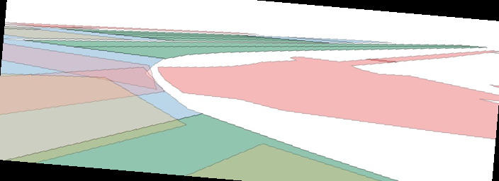
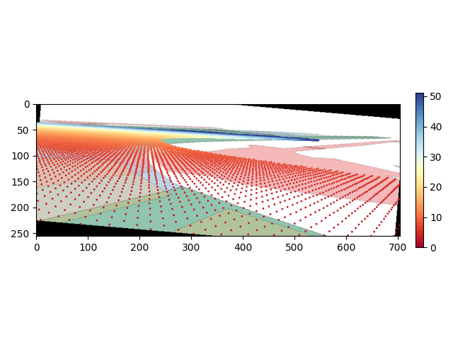
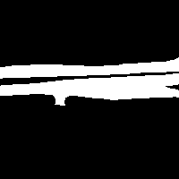
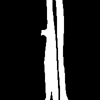

# BEVMap - Map Aware BEV Modeling for 3D Perception

## Prerequisites

### Installation
 You can install environments as following commands. If error occurs, check torch and mmcv version compatibility, or you can refer to [BEVDet](https://github.com/HuangJunJie2017/BEVDet/blob/master/docs/getting_started.md) installation guide.  
```
conda create -n open-mmlab python=3.8 -y
conda activate open-mmlab
pip install torch==1.9.1+cu111 torchvision==0.10.1+cu111 torchaudio==0.9.1 -f https://download.pytorch.org/whl/torch_stable.html
pip install mmcv-full==1.4.0
pip install mmdet==2.14.0
pip install mmsegmentation==0.14.1
python setup.py develop 
pip install numba==0.48
pip install lyft_dataset_sdk
pip install nuscenes-devkit==1.0.5
pip install numpy==1.20.3
pip install yapf==0.40.1
pip install shapely==1.8.5
```

### Data Preparation
You can directly follow [BEVDet nuscenes_det.md](https://github.com/HuangJunJie2017/BEVDet/blob/dev2.0/docs/en/datasets/nuscenes_det.md) to create pkl file for training and validation. 

Or download nuscenes dataset and do following: 

```
# symlink dataset root to ./data/
ln -s [nuscenes root] ./data/
# generate pickle files 
python tools/create_data.py nuscenes --root-path ./data/nuscenes --out-dir ./data/nuscenes --extra-tag nuscenes
```

Also download nuscenes map expansion and locate your data folders as following: 
```
|-- data
|---|--- nuscenes
|---|---|--- v1.0-trainval/mini 
|---|---|--- samples 
|---|---|--- sweeps
|---|---|--- maps 
|---|---|---|--- basemap 
|---|---|---|--- boston-seaport.json
|---|---|---|--- ...
```

## Map Dataset Generation
We provide codes for generating map projections and BEV map mask for every sample in [nuScenes](https://www.nuscenes.org/?externalData=all&mapData=all&modalities=Any) dataset. 

### Perspective View Map (RGB + Depth) Generation
```
python tools/mapdata/generate_projmap.py 
python tools/mapdata/generate_projdepth.py 
```

#### Example of augmented projected map and corresponding map depth
Projected Map            |  Projected Map with Map Depth
:-------------------------:|:-------------------------:
|

### BEV Mask Generation 
```
python tools/mapdata/generate_bevmask.py --coord 'lidar' --category 'drivable_area'
```

__Note__: We design the framework on master branch of [BEVDet](https://github.com/HuangJunJie2017/BEVDet/tree/master), which generates BEV features on LiDAR coordinates. However, recent dev2.0 branch creates BEV coordinates on egopose system, so map images should have corresponding coordinate transform too. 

BEV Map on Ego Pose             |  BEV Map on LiDAR
:-------------------------:|:-------------------------:
|


## Train 
```
bash tools/dist_train.sh 2 
```
## Inference 
```
bash tools/dist_test.sh 
```
## Comparison with Baselines
#### FP32
| Method            | mAP      | NDS     | FPS    |Mem (MB) |   Model | Log
|--------|----------|---------|--------|-------------|-----|-------|
| [**BEVDet-R50**](configs/bevdet/bevdet-r50.py)       | 29.9     | 37.7    | 16.7   | 5,007  | - | -
| [**BEVDet-R50(BEVMap)**](configs/bevmap/bevdet-r50.py) | 30.4     | 39.4    | 15.7   |5,185| - | -
| [**BEVDepth-R50**](configs/bevdepth/bevdepth-r50.py) | 33.3     | 40.6    | 15.7   |5,185| - | -
| [**BEVDepth-R50(BEVMap)***](configs/bevmap/bevdepth-r50.py) | 33.3     | 40.6    | 15.7   |5,185| - | -


## Acknowledgement 
Special thanks to Siyeong Lee from [NAVER LABS](https://www.naverlabs.com/) for help with implementation of map generation codes and experimental feedbacks.

Our code is based on master branch of [BEVDet](https://github.com/HuangJunJie2017/BEVDet/tree/master). We thank and appreciate BEVDet teams for their great work. 

We also thank other excellent open-source projects [Lift-Splat-Shoot](https://github.com/nv-tlabs/lift-splat-shoot), [mmdetection3d](https://github.com/open-mmlab/mmdetection3d).